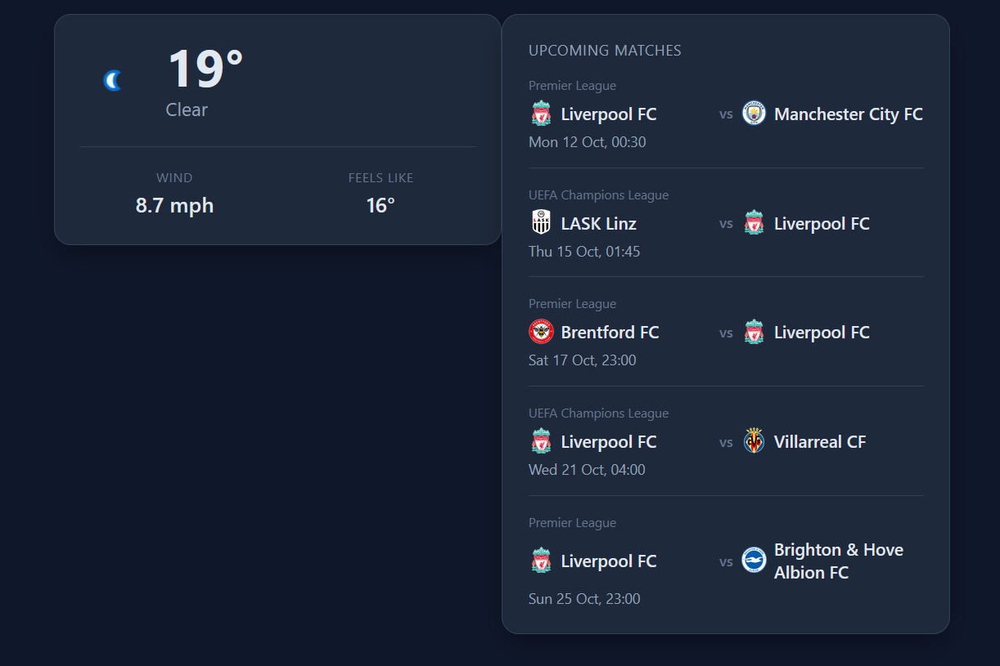

# Jamfax  

News and information sites are increasingly unreliable, messy and slow.  

The aim of this project is to create a dashboard that automatically checks various information sources and presents all the info I want in one place without ads, junk and with minimal lag.  

The goal is a compact, at-a-glance design that minimizes the need for scrolling.  

### Requirements  

Runs in the browser  
Needs API keys from supporting services  
Sports data requires setting up a Node service  

### Setup  

Sign up and get API keys from your required services.  

Currently works with:  
weatherapi.com  
football-data.org  

Rename **config.example.js** to **config.js**  
Replace the values in **config.js**:  

* WEATHER_API_KEY: your new API key.  
* WEATHER_LOCATION: your latitude and longitude, eg "35.5098,139.6145" if you're at Yokohama Ramen Museum.  

Optionally set these values to 1 or 0 depending on what you want to see.  
1 = visible, 0 = invisible  
DEV_MODE: "0", //test output  
LOAD_WEATHER: "1",  
LOAD_SPORTS: "1",  

### Setting up Sports Data via Node  

You'll need to install Node which you can read about here: https://www.w3schools.com/nodejs/nodejs_get_started.asp  

You'll also need the express and cors modules installed.  You can do this with:  
  
```
npm install express cors
```

In the Node folder:  
Rename **config.example.js** to **config.js**  
Replace the values in **config.js**:  

config.team = YOUR_TEAM_ID_HERE; You'll need to get the ID for the team you're interested in from the football-data.org website. A few examples are listed below.   
config.token = YOUR_FOOTBALL_API_TOKEN_HERE;  

A few popular team name IDs:  

* Arsenal: 57  
* Liverpool: 64  
* Manchester United: 66  


Run server.js with:  
```
node server.js  
```
The node server creates an endpoint /matches  

The main file calls this to get the games. The default URL for the Node service is: http://localhost:3000/matches  
This is currently hardcoded in main.js as the value of sports_url  
You'll need to change this if your Node setup uses a different location.  
You could run this on a service like Vercel, or AWS instead if you have access to those.  

### Using the actual dashboard  

Open index.html in your browser  

### Security  

This is a prototype and not suitable for production / public deployment. Values in config.js are visible to anyone viewing the site.  

### Screenshot




### Future Improvements

Caching Data  
More Services
